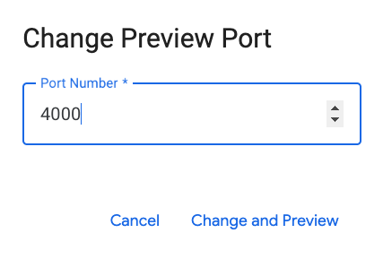
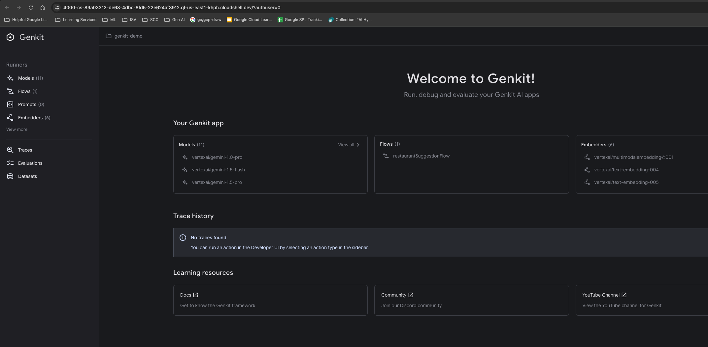

# Firebase Genkit

This repository demonstrates a simple `nodejs` application that uses __Firebase Genkit__ and configures access to various Gemini models including `gemini-2.0-flash` in Google Cloud's Vertex AI Platform.

## Initialize Firebase Genkit in Cloud Shell

1. To initialize your environment for Google Cloud, run the following commands:

```
export PROJECT_ID=$(gcloud config get-value project)
export REGION=us-central1
```

2. To authenticate the `gcloud` command-line interface and set up credentials for your project and user, run the following command:

```
gcloud auth application-default login
```

3. When prompted, type `Y` then press `ENTER`.

4. To launch the Google Cloud sign-in flow, click on the link shown in the terminal and select the email address associated with your account.

5. When you're prompted to continue, click __Continue__.

6. To let the Google Cloud SDK access your Google Account and agree to the terms, click __Allow__.

Your verification code is displayed in the browser tab.

7. Click __Copy__.

8. Back in the terminal, where it says __Enter authorization code__, paste the code and press `ENTER`.

You are now authenticated to Google Cloud via the CLI.

## Set up the demo application

1. Create a directory for your project and initialize a new node project:

```
mkdir genkit-demo && cd genkit-demo
npm init -y
```

This command creates a `package.json` file in the `genkit-intro` directory.

2. To install the Genkit CLI, run the following command:

```
npm install -D genkit-cli@1.4.0
```

3. To install the core Genkit packages and dependencies for your app, run the following command:

```
npm install genkit@1.4.0 --save
npm install @genkit-ai/vertexai@1.4.0 @genkit-ai/google-cloud@1.4.0 @genkit-ai/express@1.4.0 --save
```

## Create the Genkit application

1. Create the source folder and main file:

```
mkdir src && touch src/index.ts
```

2. From the __Cloud Shell__ menu, click __Open Editor__.

3. Open the `genkit-intro/package.json` file, and review all the dependencies that were added with Genkit.

The dependency list should look similar to the following:

```output
"dependencies": {
    "@genkit-ai/express": "^1.4.0",
    "@genkit-ai/google-cloud": "^1.4.0",
    "@genkit-ai/vertexai": "^1.4.0",
    "genkit": "^1.4.0"
}
```

4. Go to the `src` folder and open the `src/index.ts` file. Add the following import library references to the `index.ts` file:

```nodejs
import { z, genkit } from 'genkit';
import { vertexAI } from '@genkit-ai/vertexai';
import { gemini20Flash } from '@genkit-ai/vertexai';
import { logger } from 'genkit/logging';
import { enableGoogleCloudTelemetry } from '@genkit-ai/google-cloud';
import { startFlowServer } from '@genkit-ai/express';
```

5. After the import statements, add code to initialize and configure the genkit instance with the required plugin:

```nodejs
const ai = genkit({
    plugins: [
        vertexAI({ location: 'us-central1'}),
    ]
});

logger.setLogLevel('debug');
enableGoogleCloudTelemetry();
```

The Vertex AI plugin provides access to the Gemini models. The initialization code also sets the log level to debug for troubleshooting, and enables tracing and metrics for monitoring.

6. Define a flow for your application:

```nodejs
export const restaurantSuggestionFlow = ai.defineFlow(
{
    name: 'restaurantSuggestionFlow',
    inputSchema: z.string(),
    outputSchema: z.string(),
},
async (country) => {
    // Construct a request and send it to the model API.
    const llmResponse = await ai.generate({
        prompt: `Suggest a restaurant based on the ${country} provided.`,
        model: gemini20Flash,
        config: {
            temperature: 1,
        },
    });

    return llmResponse.text;
});
```

A __flow__ to suggest a restaurant based on a provided country. The __country__ of the desired cuisine is passed in as a parameter and inserted into the prompt. The model used is `gemini20Flash` with a __temperature__ setting of 1.

7. Add the following code to start the flow server, which exposes your flow as an __HTTP__ endpoint:

```
startFlowServer({
    flows: [restaurantSuggestionFlow],
});
```

## Test the app in the Genkit Developer UI

The Genkit developer UI is a local web app that you can use to interact with models, retrievers, flows and other actions in your Genkit project.

In this task, you use the Genkit developer UI to explore AI workflows, models and parameters and analyze traces for your app.

### Launch the Genkit Developer UI

1. To launch the Genkit Developer UI from your __Cloud Shell__ terminal run the following:

```
cd ~/genkit-demo
npx genkit start -- npx tsx src/index.ts
```

2. Press `ENTER` to continue.

Wait for the command to return the __Genkit Developer UI__ URL in the terminal output before proceeding.

3. In the __Web Preview__ menu of __Cloud Shell__, click __Change port__.

4. Enter __4000__ for the __Port Number__ and click __Change and Preview__.



The Genkit Developer UI will open in a separate tab of your browser.

## Test the Restaurant Suggestion Flow

The Genkit Developer UI will take a moment to load and look similar to the following:



1. To explore the predefined workflow created earlier, in the left panel click __Flows__ and then click __restaurantSuggestionFlow__.

2. For __Input JSON__ type the following:

```
Italian. Find me two places in New York City with a view.
```

